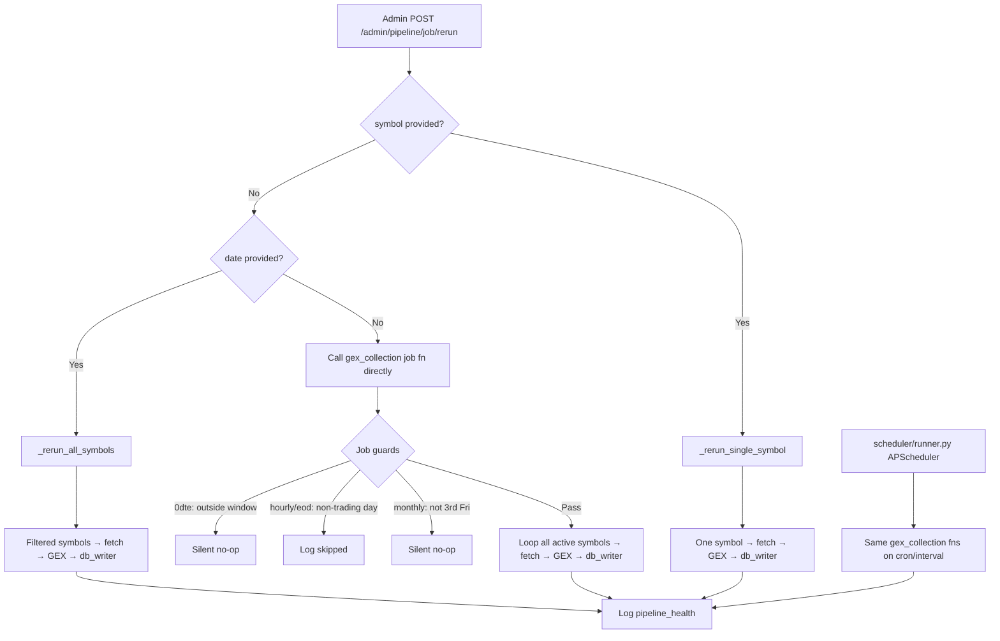

# Pipeline Scheduling & Manual Rerun

How GEX collection jobs are scheduled automatically, and how admins can trigger manual reruns from `/admin/pipeline`.

Related specs: [02-data-pipeline-gex-collection.md](spec/02-data-pipeline-gex-collection.md), [05-admin-staff-panel.md](spec/05-admin-staff-panel.md).

Canonical job IDs and UI labels live in `scheduler/job_types.py`.

---

## Job types (canonical IDs)

| Job ID | UI label | Function | What it writes |
|---|---|---|---|
| `intraday_0dte_5min` | Intraday 0DTE (every 5 min) | `run_0dte_intraday` | `gex_intraday` (`snapshot_type=0dte`) |
| `intraday_hourly` | Intraday hourly snapshots | `run_daily` | `gex_intraday` (`snapshot_type=intraday_5min`) |
| `eod_rolling_5d_weekly` | EOD rolling 5d + weekly | `run_eod` | `gex_rolling_5d` + optional `gex_weekly` |
| `monthly_opex_3rd_friday` | Monthly OPEX (3rd Friday) | `run_monthly_opex_check` | `gex_monthly_opex` |
| `zerodha_nifty_intraday` | NIFTY intraday 0DTE | `run_zerodha_intraday` | Isolated `gex_intraday` |
| `zerodha_nifty_eod` | NIFTY EOD + actual expiries | `run_zerodha_eod` | Isolated `gex_rolling_21d` + `gex_weekly` |
| `zerodha_nifty_monthly` | NIFTY monthly expiries | `run_zerodha_monthly` | Isolated `gex_monthly_opex` |

**Legacy aliases** (still accepted for manual rerun URLs and displayed in older `pipeline_health` logs):

| Legacy alias | Canonical ID |
|---|---|
| `0dte_intraday` | `intraday_0dte_5min` |
| `daily`, `daily_gex` | `intraday_hourly` |
| `eod`, `eod_gex` | `eod_rolling_5d_weekly` |
| `monthly_opex` | `monthly_opex_3rd_friday` |

New runs write the **canonical ID** to `pipeline_health.job_name`. The admin UI shows the human-readable label via `job_label()`.

---

## Two execution paths

| | **Automatic (scheduled)** | **Manual (admin rerun)** |
|---|---|---|
| Process | `python -m scheduler.runner` (standalone) | Flask web app |
| Scheduler | APScheduler `BlockingScheduler` | None — runs **inline in the HTTP request** |
| Job code | `scheduler/jobs/gex_collection.py` | Same functions (full rerun), `_rerun_all_symbols`, or `_rerun_single_symbol` |
| Coordination | PID lock (`scheduler.pid`) enforces single instance | No lock — can overlap with the scheduler |

Manual reruns do **not** enqueue work into APScheduler. They call pipeline code directly and block the HTTP request until completion.

---

## Automatic scheduler

Entry point: `scheduler/runner.py`  
Timezone: **America/Chicago (CT)**

| Job ID | Function | Trigger | Notes |
|---|---|---|---|
| `intraday_0dte_5min` | `run_0dte_intraday` | Every 5 min (`IntervalTrigger`) | Guarded internally: trading day + 8:45–14:55 CT |
| `intraday_hourly` | `run_daily` | Cron 8:50, 9:50, 10:50 … 13:50 | Skips non-trading days |
| `eod_rolling_5d_weekly` | `run_eod` | Cron 14:50 daily | Rolling 5d + weekly on last trading day of week |
| `monthly_opex_3rd_friday` | `run_monthly_opex_check` | Cron Friday 15:05 | Skips unless today is the 3rd Friday |
| `twitter_post_*` | `run_twitter_post` | Cron 8:00, 9:30, 15:30 | Separate from GEX collection |

All jobs use `max_instances=1`, `coalesce=True`, and misfire grace times so overlapping or missed ticks do not pile up.

### Zerodha/NIFTY automation

Zerodha jobs use `Asia/Kolkata` independently of the existing US/Central
schedules. Their Pipeline Health defaults are deliberately off:

- Intraday preset: 09:20–15:10 IST, every 15 minutes, and only on an actual
  listed NIFTY expiry date.
- EOD presets: 09:30 and 15:10 IST.
- Monthly preset: Monday and Friday at 15:10 IST.
- Forward windows: 12 actual option expiries and 3 actual monthly expiries.

The current Zerodha instrument master is the expiry authority. The scheduler
uses the NSE calendar as the trading-day guard, and the instrument master is
cached daily in ignored `instance/zerodha` files. NIFTY calculated documents
are written only through `ZERODHA_MONGO_URI`; all controls and health outcomes
remain in primary `MONGO_URI`.

### Trading-window guards (scheduled jobs)

Defined in `scheduler/market_utils.py`:

| Guard | Window |
|---|---|
| `is_in_0dte_window()` | Trading day, 8:45 AM – 2:55 PM CT |
| `is_trading_day()` | NYSE calendar via `pandas_market_calendars` (weekday fallback) |

---

## Admin manual rerun

### Routes & access

| Route | Method | Role | Description |
|---|---|---|---|
| `/admin/pipeline` | GET | admin, staff | View `pipeline_health` log + job types reference |
| `/admin/pipeline/<job>/rerun` | POST | admin only | Manually re-trigger a job |

Implementation: `app/routes/admin_panel.py` → `app/services/pipeline_rerun.py`

The pipeline page includes a collapsible **Job Types Reference** table (schedule, Mongo writes, symbol scope) and a **Manual Job Rerun** form for admins.

### UI flow

1. Admin opens `/admin/pipeline` and sees recent `pipeline_health` logs plus the job reference and rerun form.
2. Form fields: **Job** (required — dropdown shows human-readable labels), **Symbol** (optional), **Date** (optional, `YYYY-MM-DD`).
3. On submit, JavaScript sets the form action to `/admin/pipeline/<job>/rerun` using the canonical job ID.
4. Flask calls `rerun_job(job, symbol=..., trade_date=...)` and redirects back with a flash message.

| Form inputs | Behavior |
|---|---|
| **Date only** | Backfill **all applicable active symbols** for that trading day |
| **Symbol + date** | Reprocess one ticker for a specific day |
| **Symbol only** | Reprocess one ticker for today |
| **Neither** | Run the full scheduled job for today (scheduler guards apply) |

Manual reruns always fetch **live** option chains — the date field sets which trade date is stored in Mongo, not which historical chain is pulled.

---

## Rerun dispatcher logic

`rerun_job()` in `app/services/pipeline_rerun.py`:

1. Resolve `job` from the registry (canonical ID or legacy alias); return error if unknown.
2. **If `symbol` is provided** → `_rerun_single_symbol()` (targeted path).
3. **If `date` is provided without `symbol`** → `_rerun_all_symbols()` for that trade date.
4. **Otherwise** → call the full job function `fn()` synchronously (uses "now").

### Path A — Full job rerun (no symbol, no date)

Calls the same functions the scheduler uses. Built-in guards still apply:

| Job | Guard on full rerun | Effect if guard fails |
|---|---|---|
| `intraday_0dte_5min` | `is_in_0dte_window()` | **Silent return** — no work, no health log |
| `intraday_hourly` | `is_trading_day()` | Logs `skipped` to `pipeline_health` |
| `eod_rolling_5d_weekly` | `is_trading_day()` | Logs `skipped` |
| `monthly_opex_3rd_friday` | trading day + `is_third_friday()` | Skips silently if not 3rd Friday |

A full manual rerun outside market hours may flash **"Job triggered"** in the UI while the job function actually no-ops (especially `intraday_0dte_5min`).

`trade_date` from the form is **not** passed through to full job functions — those always use "now" for guards and trade dates.

### Path B — All-symbol backfill (date only, no symbol)

Runs `_rerun_all_symbols()` for every applicable active symbol in `symbols_config`:

1. Validates the date is a trading day (and 3rd Friday for `monthly_opex_3rd_friday`).
2. Applies the same symbol filters as the scheduled job (e.g. 0DTE stocks on Fridays only).
3. For each symbol: fetch chain → compute GEX → write to Mongo.
4. Logs one `pipeline_health` entry with total `symbols_processed`.

No trading-window guards — suitable for backfilling a past date outside market hours.

### Path C — Single-symbol rerun (symbol provided)

Bypasses the full job loop. Steps in `_rerun_single_symbol()`:

1. Look up symbol in `symbols_config` (must exist and be configured).
2. Fetch option chain via `_fetch_chain` (Schwab → CBOE → yfinance).
3. Compute GEX via `gex_engine.compute`.
4. Write to the appropriate Mongo collection via `db_writer`.
5. Log one `pipeline_health` entry.

| Job | Mongo write | Notes |
|---|---|---|
| `intraday_0dte_5min` | `write_intraday` (`snapshot_type=0dte`) | No time-window guard |
| `intraday_hourly` | `write_intraday` (`snapshot_type=intraday_5min`) | No trading-day guard |
| `eod_rolling_5d_weekly` | `write_rolling_5d` + optional `write_weekly` | Weekly if Friday or Thursday-before-closed-Friday |
| `monthly_opex_3rd_friday` | `write_monthly_opex` | Index symbols only; must be 3rd Friday |

**`trade_date` behavior (single-symbol and all-symbol paths):**

- If provided, used as `run_date` for stored trade date and validation.
- If omitted, defaults to today (CT).
- Chain data is always fetched **live** — `trade_date` does not pull historical options data.

---

## End-to-end flow diagram

---

## Health logging

All job outcomes (success, failed, skipped) are written to the `pipeline_health` collection via `_log_health()` in `scheduler/jobs/gex_collection.py`.

The `/admin/pipeline` page reads recent entries with `pipeline_health.find_recent()` and displays:

- Human-readable job label + canonical `job_name`
- `run_at`, `status`, `symbols_processed`, `detail`

Single-symbol and all-symbol manual reruns always write a health entry. Full `intraday_0dte_5min` reruns outside the trading window may write **nothing**.

---

## Operational caveats

1. **Synchronous blocking** — A full rerun over all symbols blocks the HTTP request until every symbol is processed.
2. **No scheduler integration** — Manual reruns do not appear in or reschedule APScheduler jobs.
3. **Schwab token contention** — The scheduler enforces a single instance via PID lock, but Flask manual reruns can still call Schwab concurrently. Avoid running heavy full reruns while the scheduler is active if token corruption is a concern.
4. **Use date only for all-symbol backfill** — Pick a job + date, leave symbol blank, to reprocess every active symbol for that day.
5. **Use symbol + date for one-ticker backfill** — To reprocess a single ticker outside market hours.
6. **Staff cannot rerun** — Staff role can view the health log and job reference but not submit the rerun form.
7. **Zerodha runs are live-only** — NIFTY manual jobs ignore disabled automation
   switches but require today's IST date because Kite supplies the current
   option chain. Access tokens must be rotated locally and processes restarted.
8. **No trading surface** — The admin margin form calls estimate-only margin
   endpoints. The integration does not expose place, modify, or cancel order methods.

---

## Key source files

| File | Role |
|---|---|
| `scheduler/job_types.py` | Canonical job IDs, labels, metadata, legacy alias resolution |
| `scheduler/runner.py` | APScheduler setup, cron/interval triggers, PID lock |
| `scheduler/jobs/gex_collection.py` | Job implementations, fetch/GEX/write loop, health logging |
| `scheduler/market_utils.py` | Trading day (`pandas_market_calendars`), time windows, calendar helpers |
| `data_sources/cboe_client.py` | CBOE delayed-quotes fetch with symbol-specific URL paths |
| `app/services/pipeline_rerun.py` | Manual rerun dispatcher, all-symbol and single-symbol paths |
| `app/routes/admin_panel.py` | `/admin/pipeline` routes |
| `app/templates/admin/pipeline.html` | Job reference, health log table, rerun form |
| `app/models/pipeline_health.py` | Mongo access for health log reads |
